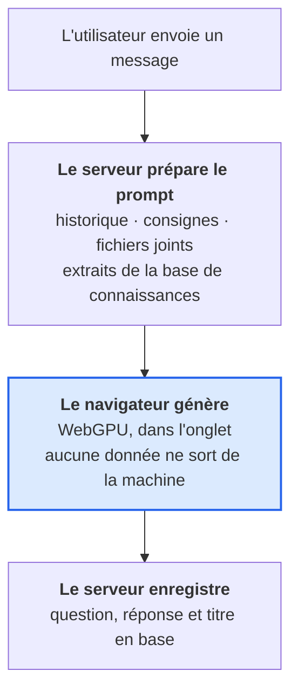

<div align="center">
  

  <h1>MyGPT</h1>
  <p>Assistant IA conversationnel - le modèle tourne dans votre navigateur, sans installation, sans abonnement, sans service tiers</p>


</div>

https://github.com/user-attachments/assets/9b079391-b17d-4230-9721-c40a35a1fa71

## Fonctionnalités

- **Le modèle tourne dans votre navigateur** (WebGPU) : rien à installer, aucun abonnement, aucune donnée de conversation envoyée pour générer
- Réponses diffusées au fil de l'eau, bouton Stop, régénération, questions modifiables
- **Base de connaissances (RAG)** : vos documents sont indexés dans pgvector, les extraits pertinents sont ajoutés avant chaque réponse - vectorisation également dans le navigateur
- Titre de conversation généré automatiquement après le premier échange
- Choix du modèle à chaque message, du plus léger (0,8 Md de paramètres) au plus capable (8 Md)
- Pièces jointes texte et code (10 Mo max) inlinées dans le prompt
- Dictée vocale et lecture à voix haute des réponses
- Conversations épinglées, archivées, rangées dans des dossiers avec consignes communes
- Recherche globale (Ctrl/⌘ + K) dans les conversations et les messages
- Consignes personnalisées et modèle par défaut dans les réglages
- Rendu Markdown complet et blocs de code colorés (Shiki), copiables en un clic
- Partage par lien en lecture seule, accessible sans compte, avec expiration optionnelle
- Bibliothèque des conversations partagées enregistrées
- Thème clair, sombre ou système, interface responsive

## Stack

| Couche    | Technologies                                                                       |
| --------- | ---------------------------------------------------------------------------------- |
| Frontend  | Vue 3, Vite, Nuxt UI 4, Tailwind CSS 4, Pinia, Pinia Colada, Zod, Playwright       |
| Backend   | NestJS 12, TypeORM, PostgreSQL + pgvector, Passport, Swagger, Jest                 |
| IA        | WebLLM / WebGPU - génération et embeddings dans le navigateur, aucun service tiers |
| Outillage | npm workspaces, ESLint, Prettier, Husky, lint-staged, Commitlint, Docker           |

## Démarrage rapide

**Prérequis :** Node.js ≥ 24.9, Docker, et un navigateur compatible WebGPU (Chrome, Edge, Safari 26+, Firefox récent). Aucune clé d'API, aucun compte chez un fournisseur d'IA.

```bash
git clone https://github.com/Pagiestm/MyGPT.git
cd MyGPT
npm install
cp .env.example .env
```

Un **seul `.env` à la racine** est lu par Docker Compose, le serveur et le client (seules les variables `VITE_*` sont exposées au navigateur).

### Option 1 - Tout dans Docker

```bash
docker compose up -d
```

| Service       | URL                       | Accès                              |
| ------------- | ------------------------- | ---------------------------------- |
| Application   | http://localhost:5173     |                                    |
| API / Swagger | http://localhost:3000/api |                                    |
| pgAdmin       | http://localhost:5050     | hôte `db`, `postgres` / `root`     |
| PostgreSQL    | `localhost:5432`          | `postgres` / `root`, base `my-gpt` |

Le code source est monté dans les conteneurs : toute modification locale recharge automatiquement le front (HMR Vite) et le back (`nest --watch`).

```bash
docker compose logs -f server   # suivre les logs
docker compose down             # arrêter
docker compose down -v          # arrêter et supprimer les données
docker compose up -d --build    # reconstruire après un changement de dépendances
```

### Option 2 - Base en Docker, apps en local

```bash
docker compose up -d db pgadmin   # PostgreSQL + pgAdmin
npm run dev                       # serveur + client en parallèle
```

## Comment fonctionnent les modèles

Le modèle s'exécute **entièrement dans l'onglet de l'utilisateur**, via WebGPU. Le serveur ne
détient aucun poids, n'exécute aucun modèle et n'appelle aucune API d'IA. Il reste la seule source
de vérité du prompt et le seul à écrire en base.



Concrètement, un échange se déroule en trois appels :

| Appel                                    | Qui agit   | Ce qui se passe                                        |
| ---------------------------------------- | ---------- | ------------------------------------------------------ |
| `POST /chat/messages`                    | serveur    | enregistre la question, renvoie le prompt complet      |
| -                                        | navigateur | génère la réponse en WebGPU, l'affiche au fil de l'eau |
| `POST /chat/replies` puis `/chat/titles` | serveur    | enregistre la réponse, puis le titre                   |

### Où sont stockés les poids

Dans le **Cache Storage du navigateur** de chaque utilisateur, cloisonné à l'origine de
l'application. WebLLM y crée trois caches nommés :

| Cache           | Contenu                                    |
| --------------- | ------------------------------------------ |
| `webllm/model`  | les poids du modèle, découpés en fragments |
| `webllm/wasm`   | le runtime WebGPU compilé pour ce modèle   |
| `webllm/config` | le `mlc-chat-config.json` et le tokenizer  |

Pour les voir : **DevTools → Application → Storage → Cache Storage**, sur l'origine de
l'application. Sous Chrome/macOS, les fichiers correspondants vivent dans
`~/Library/Application Support/Google/Chrome/<Profil>/Service Worker/CacheStorage/`, mais ce ne
sont pas des fichiers à manipuler à la main : c'est un stockage géré par le navigateur.

Trois conséquences pratiques :

- le cache est **propre à chaque navigateur et à chaque profil** - passer de Chrome à Firefox
  retélécharge tout, la navigation privée ne garde rien ;
- effacer les données du site supprime les modèles ; la page **Réglages → Modèles** le fait
  proprement, modèle par modèle ;
- le serveur n'a aucune visibilité dessus : il ne sait même pas quels modèles existent.

### Comment un modèle arrive

Aucun téléchargement ne démarre tout seul. L'utilisateur choisit un modèle et envoie son premier
message ; les fichiers sont alors récupérés depuis deux origines, avec une barre de progression :

| Ce qui est téléchargé | Depuis                                                                   | Épinglé ?                                |
| --------------------- | ------------------------------------------------------------------------ | ---------------------------------------- |
| Les poids             | `huggingface.co/mlc-ai/<id-du-modèle>` (branche `main`)                  | **non**                                  |
| Le runtime wasm       | `raw.githubusercontent.com/mlc-ai/binary-mlc-llm-libs/.../v0_2_84/base/` | oui, par la version de `@mlc-ai/web-llm` |

Le catalogue **vit en base** (`ai_models`), pas dans le code. Un administrateur l'ajuste depuis la
page **/admin** : ajouter, masquer, retirer un modèle, sans
redéploiement. Les identifiants proposés viennent de `prebuiltAppConfig`, la vraie liste de WebLLM,
pour qu'on ne puisse pas inscrire un modèle que le navigateur ne saurait pas charger.

Une instance neuve se sème au premier démarrage avec huit modèles, de 0,8 à 8 milliards de
paramètres (`server/src/models/ai-model.catalog.ts`) - ensuite le code ne s'en mêle plus.

Qui est responsable ? Les comptes portent un **rôle** (`user` ou `admin`) stocké en base.
Voir « Rôles et administration » plus bas.

| Taille du modèle                | Téléchargement | Mémoire vive ou graphique |
| ------------------------------- | -------------- | ------------------------- |
| 0,8 à 2 milliards de paramètres | 1,6 à 2,2 Go   | 2 à 3 Go                  |
| 3 à 4 milliards                 | 2,3 à 3,4 Go   | 3 à 4 Go                  |
| 7 à 8 milliards                 | 5 Go           | 5 à 6 Go                  |

En dessous de 8 Go de mémoire, seuls les plus petits modèles tournent.

### Comment un modèle est mis à jour

Chaque modèle du catalogue porte une **révision**. Un responsable clique sur « Rafraîchir les
poids » dans /admin, la révision s'incrémente, et c'est tout : au prochain message, chaque
navigateur compare la révision reçue à celle qu'il a en mémoire, et si elles diffèrent il **vide
son cache et retélécharge** le modèle. L'utilisateur ne fait rien, et n'a rien à savoir - il voit
seulement la barre de progression une fois.

```
révision en base : 2        révision connue du navigateur : 1
                 └──────────────► cache vidé, poids retéléchargés
```

Hors de ce mécanisme, **rien ne bouge** : un modèle déjà téléchargé n'est jamais revérifié, et
l'utilisateur garde les octets reçus la première fois.

Ce qui change par ailleurs, sans intervention :

- **le runtime wasm** suit la version de `@mlc-ai/web-llm` : son URL contient la version
  (`v0_2_84/base`). Monter la dépendance change l'URL, donc le fichier ;
- **les poids** sont servis depuis la branche `main` du dépôt Hugging Face correspondant, donc non
  figés : un nouvel utilisateur reçoit ce que `main` contient à ce moment-là.

> **Limite assumée.** WebLLM sait vérifier une empreinte (`ModelRecord.integrity`), mais aucun des
> 163 modèles du catalogue préfabriqué n'en fournit - vérifié en lisant `prebuiltAppConfig`. Pour
> figer réellement les poids, il faudrait héberger ses propres fichiers et déclarer un `AppConfig`
> maison avec les empreintes.

### Modèles à raisonnement

Qwen 3 et les modèles dérivés de DeepSeek-R1 émettent leur réflexion entre `<think>` et `</think>`.
WebLLM la laisse dans le contenu : un filtre incrémental la retire du flux et du titre
(`client/src/domain/reasoning.ts`), y compris quand une balise est coupée entre deux morceaux.

### Pas de WebGPU ?

L'application le signale au lieu d'échouer en silence : le sélecteur affiche « Navigateur sans
WebGPU » et l'envoi d'un message renvoie un message explicite. Il n'y a pas de repli vers un service
en ligne - c'est le choix assumé du projet.

## Rôles et administration

Deux rôles, portés par une colonne `role` de la table `users` :

| Rôle    | Peut                                                                         |
| ------- | ---------------------------------------------------------------------------- |
| `user`  | tout ce qui lui appartient : conversations, dossiers, documents, préférences |
| `admin` | en plus : gérer le catalogue de modèles et les rôles des autres comptes      |

Tout le reste des droits se déduit de la **propriété des données**, pas du rôle : un administrateur
ne voit pas les conversations des autres.

### Comment ça marche

Patron natif de NestJS, sans bibliothèque supplémentaire : un décorateur `@Roles(UserRole.Admin)`
pose la contrainte, un `RolesGuard` la lit via le `Reflector`. Le rôle est **relu en base** à chaque
requête protégée plutôt que lu dans la session : un administrateur rétrogradé perd ses droits
immédiatement, sans avoir à se reconnecter.

```ts
@Patch(':id/role')
@UseGuards(AuthenticatedGuard, RolesGuard)
@Roles(UserRole.Admin)
updateRole(@Param('id', ParseUUIDPipe) id: string, @Body() dto: UpdateRoleDto) { … }
```

### Le premier administrateur

Aucun compte ne l'est à l'inscription. Le tout premier se désigne **directement en base**, une fois
pour toutes :

```sql
UPDATE users SET role = 'admin' WHERE email = 'vous@exemple.com';
```

```bash
docker compose exec db psql -U postgres -d my-gpt \
  -c "UPDATE users SET role = 'admin' WHERE email = 'vous@exemple.com';"
```

pgAdmin (http://localhost:5050) fait la même chose à la souris. Le changement est pris en compte
immédiatement : le rôle est relu à chaque requête, sans reconnexion.

Les administrateurs suivants se gèrent dans la page **/admin**, accessible depuis le menu du
compte et visible des seuls administrateurs. Elle réunit les comptes et leurs rôles, et le
catalogue de modèles. Un garde-fou empêche de retirer le **dernier** administrateur : sans lui,
plus personne ne pourrait administrer l'instance sans repasser par la base.

## Base de connaissances (RAG)

Les documents envoyés dans **Réglages → Base de connaissances** sont découpés en extraits,
vectorisés **par le navigateur**, puis stockés dans `knowledge_chunks` - une entité TypeORM
ordinaire, dont la colonne `vector(768)` est créée par `synchronize` comme toutes les autres.
Avant chaque réponse, le navigateur vectorise la question et le serveur ajoute les extraits les
plus proches aux consignes système.

La recherche est **exacte** (distance cosinus sur toute la table), sans index approché : le
décorateur `@Index` de TypeORM ne couvre pas HNSW, et à l'échelle d'une base documentaire
personnelle le parcours complet est à la fois rapide et plus fidèle qu'une recherche approchée.

L'indexation se fait en deux temps, sur le même principe que le chat :

| Appel                    | Qui agit   | Ce qui se passe                                                               |
| ------------------------ | ---------- | ----------------------------------------------------------------------------- |
| `POST /knowledge/chunks` | serveur    | valide le fichier et le découpe, sans rien enregistrer                        |
| -                        | navigateur | vectorise chaque extrait (`snowflake-arctic-embed-m`, 539 Mo, 768 dimensions) |
| `POST /knowledge`        | serveur    | enregistre le document et ses vecteurs                                        |

- Formats : texte, Markdown, CSV, JSON, XML, YAML, HTML (2 Mo max). Convertir les PDF en texte.
- Portée : un document sans dossier s'applique à tout le compte ; associé à un dossier, il ne sert
  que pour les conversations de ce dossier.
- Le modèle d'embedding n'est chargé que si l'utilisateur s'en sert, et tourne dans un moteur
  distinct de celui de conversation pour ne pas le décharger de la mémoire graphique.

L'extension `vector` est installée par TypeORM lui-même au démarrage, comme il le fait déjà pour
`uuid-ossp` : il n'y a aucun script SQL dans le dépôt. L'image `pgvector/pgvector` fournit les
binaires, TypeORM fait le reste.

## Scripts

Tous les scripts se lancent depuis la racine.

| Commande                          | Description                                |
| --------------------------------- | ------------------------------------------ |
| `npm run dev`                     | Lance le serveur et le client              |
| `npm run build`                   | Build des deux applications                |
| `npm run lint` / `lint:fix`       | ESLint sur tout le monorepo                |
| `npm run format` / `format:check` | Prettier sur tout le monorepo              |
| `npm run typecheck`               | Vérification TypeScript (client + serveur) |
| `npm test` / `test:cov`           | Tests unitaires Jest (serveur)             |
| `npm run test:e2e`                | Tests end-to-end Playwright (client)       |

Pour cibler un workspace : `npm run <script> -w server` ou `-w client`.

## Tests

Le projet suit une approche **TDD** (Red → Green → Refactor).

- **Unitaires** - Jest sur les services, contrôleurs, guards et stratégies du serveur.
- **End-to-end** - Playwright sur Chromium, Firefox et WebKit, contre le build de production (`vite preview`). Un faux back-end en mémoire (`client/tests/support/fakeApi.ts`) répond à toute l'API : les tests n'ont besoin ni de base de données ni de GPU - la génération est jouée par un double activé par `VITE_FAKE_LLM=1`, éliminé du build de production.

https://github.com/user-attachments/assets/faf5ac6b-41f5-45c2-8487-6794d810c52e

https://github.com/user-attachments/assets/3ad72488-0684-4037-8e9a-581f421c15e6

## Qualité de code

- **ESLint + Prettier** : une configuration unique à la racine (`eslint.config.mjs`, `.prettierrc.json`) pour le client et le serveur.
- **Husky + lint-staged** : avant chaque commit, ESLint et Prettier s'exécutent sur les seuls fichiers indexés.
- **Commitlint** : messages au format [Conventional Commits](https://www.conventionalcommits.org/) - `type(scope): description`, avec les types `feat`, `fix`, `docs`, `style`, `refactor`, `perf`, `test`, `build`, `ci`, `chore`, `revert`.
- **GitHub Actions** : sur `main` et `develop`, format, lint et typecheck, puis tests unitaires avec couverture, puis tests E2E.

## Architecture du client

Le client suit une **clean architecture** en quatre couches. Chaque couche ne dépend que de celles du dessous.

```
client/src/
├── domain/          # entités, schémas Zod, règles métier pures (sans Vue ni HTTP)
├── infrastructure/  # client HTTP et un repository par ressource de l'API
├── application/     # store de session, composables de cas d'usage (requêtes, mutations, cache)
└── presentation/    # router, layouts, vues (une par route), composants
```

- **Routes déclarées explicitement** dans `presentation/router/routes.ts`, avec garde d'authentification et redirection des anciennes URL.
- **Imports explicites** partout, y compris pour les composants Nuxt UI : aucun auto-import.
- **Pinia Colada** gère le cache des requêtes, les états de chargement et les mises à jour optimistes (la question s'affiche avant la réponse de l'IA, puis la réponse s'écrit au fil du flux).

## Structure

```
MyGPT/
├── client/                 # Vue 3 + Vite
│   ├── src/                # domain, infrastructure (WebGPU), application, presentation
│   ├── tests/              # tests Playwright et faux back-end
│   └── Dockerfile
├── server/                 # NestJS
│   ├── src/                # auth (rôles), user, conversation, message, chat, knowledge, models
│   └── Dockerfile
├── docker-compose.yml      # PostgreSQL (pgvector), pgAdmin, server, client
├── .env.example            # variables d'environnement (unique)
├── eslint.config.mjs
└── package.json            # workspaces + outillage partagé
```

## Licence

[CC BY-NC-SA 4.0](LICENSE) : usage non commercial, attribution obligatoire, partage dans les mêmes conditions.

---

<p align="center">Développé par Théotime · © 2025</p>
