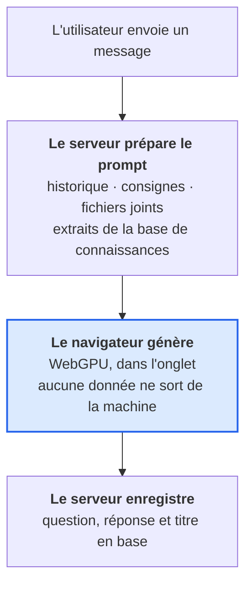

<div align="center">
  <picture>
    <source media="(prefers-color-scheme: dark)" srcset="client/public/logo-white.svg" />
    
  </picture>

  <h1>MyGPT</h1>
  <p>Assistant IA conversationnel - le modèle tourne dans votre navigateur, sans installation, sans abonnement, sans service tiers</p>


</div>

https://github.com/user-attachments/assets/9b079391-b17d-4230-9721-c40a35a1fa71

## Fonctionnalités

- **Modèle exécuté dans le navigateur** (WebGPU) : rien à installer, aucun abonnement, aucune donnée envoyée pour générer
- **Base de connaissances (RAG)** : documents indexés dans pgvector, vectorisés eux aussi dans le navigateur
- Réponses au fil de l'eau, bouton Stop, régénération, questions modifiables, titre automatique
- Dossiers, épinglage, archives, recherche globale (Ctrl/⌘ + K), partage par lien
- Pièces jointes texte et code, dictée vocale, lecture à voix haute
- Rendu Markdown et code colorés (Shiki), thème clair/sombre, responsive

## Stack

| Couche    | Technologies                                                                         |
| --------- | ------------------------------------------------------------------------------------ |
| Frontend  | Vue 3, Vite, Nuxt UI 4, Tailwind CSS 4, Pinia Colada, Zod, Playwright                |
| Backend   | NestJS 12, TypeORM, PostgreSQL + pgvector, Passport, Swagger, Jest                   |
| IA        | [`@mlc-ai/web-llm`](https://github.com/mlc-ai/web-llm) - WebGPU, aucun service tiers |
| Outillage | npm workspaces, ESLint, Prettier, Husky, Commitlint, Docker                          |

## Démarrage

**Prérequis :** Node.js ≥ 24.9, Docker, un navigateur WebGPU (Chrome, Edge, Safari 26+, Firefox récent). Aucune clé d'API.

```bash
git clone https://github.com/Pagiestm/MyGPT.git
cd MyGPT && npm install && cp .env.example .env
docker compose up -d
```

| Service       | URL                       | Accès                              |
| ------------- | ------------------------- | ---------------------------------- |
| Application   | http://localhost:5173     |                                    |
| API / Swagger | http://localhost:3000/api |                                    |
| pgAdmin       | http://localhost:5050     | hôte `db`, `postgres` / `root`     |
| PostgreSQL    | `localhost:5432`          | `postgres` / `root`, base `my-gpt` |

Le code est monté dans les conteneurs : le rechargement à chaud fonctionne. Après un changement de dépendances, `docker compose up -d --build`.

Sans Docker pour les apps : `docker compose up -d db pgadmin` puis `npm run dev`.

## Comment fonctionnent les modèles

Le modèle s'exécute dans l'onglet de l'utilisateur. Le serveur ne détient aucun poids et n'appelle aucune API d'IA : il assemble le prompt et écrit en base.



| Appel                                    | Qui agit   | Ce qui se passe                           |
| ---------------------------------------- | ---------- | ----------------------------------------- |
| `POST /chat/messages`                    | serveur    | enregistre la question, renvoie le prompt |
| -                                        | navigateur | génère la réponse en WebGPU               |
| `POST /chat/replies` puis `/chat/titles` | serveur    | enregistre la réponse, puis le titre      |

### La bibliothèque

`@mlc-ai/web-llm` est une **bibliothèque npm, pas une API** : ni clé, ni quota, aucun appel réseau par message. À ne pas confondre avec Ollama, que ce projet n'utilise pas.

Deux fichiers l'utilisent, tous deux côté client :

| Fichier                                                       | Rôle                                  |
| ------------------------------------------------------------- | ------------------------------------- |
| `client/src/infrastructure/repositories/webllm.repository.ts` | moteur, génération, embeddings, cache |
| `client/src/infrastructure/workers/webllm.worker.ts`          | héberge le moteur dans un Web Worker  |

Elle pèse ~6 Mo : chargée par `import()` dynamique, seulement quand un modèle sert. Un test e2e verrouille ce point.

### Catalogue, stockage, mises à jour

Le catalogue vit en **base** (`ai_models`), administrable depuis `/admin` sans redéploiement. Les identifiants proposés viennent de `prebuiltAppConfig`, la liste réelle de WebLLM.

Les poids sont téléchargés au premier message et conservés dans le **Cache Storage du navigateur** (`webllm/model`, `webllm/wasm`, `webllm/config`) - propre à chaque navigateur et profil.

| Fichier      | Origine                                                                  | Épinglé            |
| ------------ | ------------------------------------------------------------------------ | ------------------ |
| Poids        | `huggingface.co/mlc-ai/<id>` (branche `main`)                            | **non**            |
| Runtime wasm | `raw.githubusercontent.com/mlc-ai/binary-mlc-llm-libs/.../v0_2_84/base/` | par la version npm |

Rien ne se met à jour tout seul. Chaque modèle porte une **révision** : l'incrémenter depuis `/admin` fait vider le cache et retélécharger les poids chez tous les utilisateurs, sans action de leur part.

> WebLLM sait vérifier une empreinte (`ModelRecord.integrity`), mais aucun des 163 modèles du catalogue préfabriqué n'en fournit. Pour figer réellement les poids, il faudrait les héberger soi-même.

Les modèles à raisonnement (Qwen 3, DeepSeek-R1) émettent des blocs `<think>` : un filtre incrémental les retire du flux et du titre (`client/src/domain/reasoning.ts`).

Sans WebGPU, l'application le signale au lieu d'échouer. Il n'y a pas de repli vers un service en ligne.

## Sécurité

| Protection        | Mise en oeuvre                                                                              |
| ----------------- | ------------------------------------------------------------------------------------------- |
| Sessions          | stockées en base (`user_sessions`), elles survivent aux redéploiements                      |
| Secret de session | obligatoire en production, 32 caractères minimum, refus de démarrer sinon                   |
| Cookie de session | `httpOnly`, `secure` et `sameSite: strict` en production                                    |
| CSRF              | double soumission : cookie `csrf_token` + en-tête `X-CSRF-Token` sur toute méthode non sûre |
| Origine           | les requêtes d'écriture venant d'une origine non déclarée sont refusées                     |
| En-têtes          | `helmet` (HSTS, `nosniff`, `X-Frame-Options`, `Referrer-Policy`)                            |
| Débit             | 10 req/s et 120 req/min par IP ; 10 tentatives / 15 min sur connexion et inscription        |

Le client récupère le jeton sur `GET /csrf`, le met en cache et le renvoie automatiquement via un
intercepteur axios ; sur un 403 il le renouvelle et rejoue la requête une fois.

## Migrations

Le schéma est décrit par les entités. En développement, `synchronize` les applique ; en
production il est désactivé et les **migrations** font foi, appliquées au démarrage.

```bash
npm run migration:generate -w server -- src/database/migrations/NomDeLaMigration
npm run migration:run -w server
npm run migration:revert -w server
npm run migration:show -w server
```

La configuration est partagée entre Nest et le CLI TypeORM
(`server/src/database/data-source.options.ts`), pour qu'ils ne puissent pas diverger.

## Rôles et administration

Deux rôles sur `users.role` : `user` et `admin`. Un administrateur gère le catalogue de modèles et les rôles ; tout le reste se déduit de la propriété des données.

Patron natif NestJS, sans bibliothèque : `@Roles(UserRole.Admin)` + `RolesGuard`. Le rôle vient de la session, rechargée depuis la base à chaque requête - une rétrogradation prend effet immédiatement.

Le premier administrateur se désigne en base :

```bash
docker compose exec db psql -U postgres -d my-gpt \
  -c "UPDATE users SET role = 'admin' WHERE email = 'vous@exemple.com';"
```

Les suivants se gèrent dans **/admin**. Un garde-fou empêche de retirer le dernier administrateur.

## Base de connaissances (RAG)

Indexation en deux temps, comme le chat :

| Appel                    | Qui agit   | Ce qui se passe                                  |
| ------------------------ | ---------- | ------------------------------------------------ |
| `POST /knowledge/chunks` | serveur    | valide et découpe, sans rien enregistrer         |
| -                        | navigateur | vectorise (`snowflake-arctic-embed-m`, 768 dim.) |
| `POST /knowledge`        | serveur    | enregistre le document et ses vecteurs           |

Formats : texte, Markdown, CSV, JSON, XML, YAML, HTML (2 Mo max). Un document sans dossier vaut pour tout le compte ; associé à un dossier, il ne sert que pour ses conversations.

La recherche est **exacte** (cosinus sur toute la table), sans index approché : le décorateur `@Index` de TypeORM ne couvre pas HNSW, et le parcours complet est rapide à cette échelle. L'extension `vector` est installée par TypeORM au démarrage, comme `uuid-ossp`.

## Pagination

Toutes les listes et les recherches sont paginées : 25 éléments par page, 100 au maximum. Côté client, `usePaginatedList` accumule les pages et expose `items` / `hasMore` / `loadMore`.

## Scripts

Depuis la racine ; `-w server` ou `-w client` pour cibler un workspace.

| Commande                          | Description                                |
| --------------------------------- | ------------------------------------------ |
| `npm run dev`                     | Lance le serveur et le client              |
| `npm run build`                   | Build des deux applications                |
| `npm run lint` / `lint:fix`       | ESLint sur tout le monorepo                |
| `npm run format` / `format:check` | Prettier sur tout le monorepo              |
| `npm run typecheck`               | Vérification TypeScript (client + serveur) |
| `npm test` / `test:cov`           | Tests unitaires Jest (serveur)             |
| `npm run test:e2e`                | Tests end-to-end Playwright (client)       |
| `npm run migration:*`             | Migrations TypeORM (`-w server`)           |

## Tests

Approche **TDD**. Jest sur le serveur ; Playwright sur Chromium, Firefox et WebKit, contre le build de production.

Un faux back-end en mémoire (`client/tests/support/fakeApi.ts`) répond à toute l'API : ni base de données, ni GPU. La génération est jouée par un double activé par `VITE_FAKE_LLM=1`, éliminé du build de production.

https://github.com/user-attachments/assets/faf5ac6b-41f5-45c2-8487-6794d810c52e

https://github.com/user-attachments/assets/3ad72488-0684-4037-8e9a-581f421c15e6

## Qualité de code

ESLint + Prettier à la racine, Husky + lint-staged avant chaque commit, [Conventional Commits](https://www.conventionalcommits.org/) via Commitlint. GitHub Actions sur `main` et `develop` : format, lint, typecheck, tests unitaires avec couverture, puis E2E.

## Structure

Le client suit une clean architecture en quatre couches, chacune ne dépendant que de celles du dessous.

```
MyGPT/
├── client/
│   ├── src/
│   │   ├── domain/          # entités, schémas Zod, règles métier pures
│   │   ├── infrastructure/  # client HTTP, repositories, moteur WebGPU
│   │   ├── application/     # store de session, composables de cas d'usage
│   │   └── presentation/    # router, layouts, vues, composants
│   └── tests/               # Playwright et faux back-end
├── server/src/              # auth (rôles), user, conversation, message, chat, knowledge, models
├── docker-compose.yml       # PostgreSQL (pgvector), pgAdmin, server, client
└── .env.example
```

Imports explicites partout, y compris pour Nuxt UI : aucun auto-import. Pinia Colada gère le cache, les états de chargement et les mises à jour optimistes.

## Licence

[CC BY-NC-SA 4.0](LICENSE) : usage non commercial, attribution obligatoire, partage dans les mêmes conditions.

---

<p align="center">Développé par Théotime · © 2025</p>
